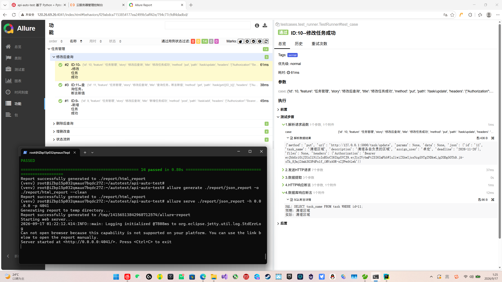
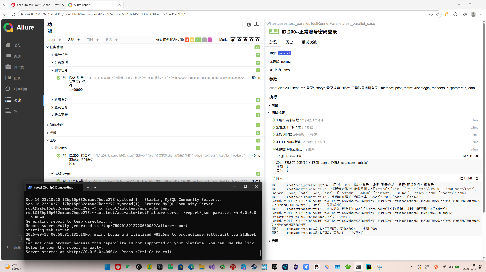

# 任务管理系统 · 接口自动化测试框架

基于 Python + Pytest 的接口自动化测试框架。被测对象为自建的 Flask 简易后端，用于可控构造测试场景；框架支持 Excel 数据驱动、HTTP + 数据库双重断言、串行与并行执行、Allure 可视化报告，并已部署至阿里云服务器，支持一键部署与测试

## 技术栈

Python 3.11+ | Pytest | pytest-xdist | Allure-Pytest | Requests | Jinja2 | openpyxl | pymysql | Shell | Linux

## 核心亮点

- **数据驱动**：用例写在 Excel 中，按场景分 Sheet 维护，新增/修改用例无需改代码。
- **双重断言**：接口返回和数据库落库结果都校验，避免“接口返回成功但数据没入库”的漏测。
- **并行执行**：基于 pytest-xdist 多进程并行，function 级后置清理，worker 间数据互不干扰。
- **动态渲染**：用例中的 `{{token}}`、`{{ID}}` 等占位符在执行时动态替换，解决接口间参数传递问题，让链路用例复用同一份 Excel。
- **场景分层**：串行链路、独立正向+反向、边界异常三类用例分开维护，串行用例保证依赖，并行用例提升速度，边界用例展示测试设计。
- **报告可视化**：接入 Allure，用例步骤、请求响应、SQL 断言详情都可在报告中追溯。
- **云端部署 + 一键脚本**：部署至阿里云 Ubuntu，编写 Shell 脚本实现部署、测试自动化 

## 项目结构

```text
jkzdh封装/
├── backend/                        # 被测系统：Flask 后端
│   ├── settings.py                 # 后端配置（读 .env）
│   └── simulate_back.py            # Flask 服务入口
├── config/                         # 测试侧配置
│   └── config.py                   # 读 .env，暴露数据库/接口常量
├── data/                           # 测试数据
│   └── 用例.xlsx                   # 3 个 Sheet：串行 / 并行 / 边界
├── docs/                           # 项目文档
│   ├── allure_serial.png           # 串行报告截图（云端）
│   └── allure_parallel.png         # 并行报告截图（云端）
├── scripts/                        # 自动化脚本
│   ├── init.sh                     # 首次初始化 
│   ├── deploy.sh                   # 日常部署             
│   └──  run_test.sh                # 测试 + 报告            
├── testcases/                      # pytest 用例代码
│   ├── test_runner.py              # 串行链路
│   └── test_parallel.py            # 独立正向并行
├── utils/                          # 工具包
│   ├── excel_utils.py              # Excel 读取
│   ├── allure_utils.py             # Allure 报告步骤与附件封装
│   ├── analyse_case.py             # 解析用例，生成请求参数
│   ├── extractor.py                # 响应提取：JSONPath / SQL / 参数
│   ├── render_obj.py               # Jinja2 模板渲染
│   ├── send_request.py             # 发送 HTTP 请求
│   └── asserts.py                  # HTTP / 数据库断言
├── init_db.py                      # 数据库初始化脚本
├── run.py                          # 一键执行入口（默认串行 + Allure 报告）
├── conftest.py                     # fixture：token、数据清理
├── pytest.ini                      # pytest 全局配置
├── requirements.txt                # 依赖清单
├── .env.example                    # 环境变量模板
└── README.md
```

## Excel 用例划分

`data/用例.xlsx` 分 3 个 Sheet：

| Sheet | 场景 | 说明 |
|-------|------|------|
| case1 | 串行链路 | 接口有前后依赖，上一步返回值传给下一步 |
| case2 | 独立用例 | 无依赖，可并行，覆盖正向和反向场景 |
| case3 | 边界异常 | 边界值、非法参数、越权，后端不支持的部分标记为不执行 |

> case3 用于展示边界和异常场景的测试设计：
>
> - 当前简易后端实现了部分异常校验，有部分用例能跑通（如 `size` 超限、`status` 非法值）；
> - 其余后端不支持的用例标记为 `is_true=FALSE` 不执行，保留作为测试设计示例；
> - case3 可通过串行方式执行：将 `test_runner.py` 中 `read_excel` 的参数从 `case1` 改为 `case3`。

## 环境要求

- Python 3.11+
- MySQL 8.0+
- Allure 命令行（生成 HTML 报告）

## 快速开始（本地部署）

### 1. 安装依赖

```bash
pip install -r requirements.txt
```

### 2. 配置环境变量

复制 `.env.example` 为 `.env`，填写数据库连接信息与密钥：

```bash
cp .env.example .env
```

`.env` 关键项说明：

| 变量 | 说明 |
|------|------|
| DB_HOST / DB_PORT / DB_USER / DB_PASSWORD / DB_NAME | MySQL 连接信息 |
| DB_CHARSET | 数据库字符集，默认 utf8mb4 |
| BASE_URL | 后端服务地址，默认 http://127.0.0.1:5000 |
| FLASK_HOST / FLASK_PORT | 后端服务监听地址和端口 |
| FLASK_DEBUG | 后端 debug 模式 |
| LOGIN_USER / LOGIN_PASSWORD | 自动化登录账号 |
| SECRET_KEY | JWT 密钥，需与后端一致 |
| JWT_EXPIRE | Token 过期时间（秒） |
| VAR_NAME | Excel 中 ID 提取字段的前缀 |
| EXCEL_FILE | Excel 用例文件路径 |

### 3. 初始化数据库

确保 MySQL 已启动，然后执行：

```bash
python init_db.py
```

脚本会自动完成：

- 创建数据库（默认 task_system）
- 创建 users、task 两张表
- 插入默认登录账号

### 4. 启动后端服务

```bash
python backend/simulate_back.py
```

启动成功后，访问 http://127.0.0.1:5000/health，返回 `{"status":"ok"}` 即正常。

### 5. 运行测试

另开一个终端，在项目根目录执行。

**方式一：pytest 命令（快速执行，看终端输出）**

```bash
# 串行链路（读 case1）
pytest -m serial

# 并行正向（读 case2，4 个 worker）
pytest -m parallel -n 4
```

**方式二：run.py 一键执行（自动生成 Allure HTML 报告）**

```bash
# 默认执行串行链路用例（读 case1），并生成 Allure HTML 报告
python run.py
```

如需执行并行用例：

1. 注释掉 `run.py` 中串行部分
2. 取消 `run.py` 中并行部分的注释
3. 再次执行 `python run.py`

报告生成位置：

| 模式 | Allure 原始数据 | HTML 报告 |
|------|-----------------|-----------|
| 串行 | `report/json_report` | `report/html_report` |
| 并行 | `report/json_parallel` | `report/html_parallel` |

HTML 报告可直接用浏览器打开。如需临时启动服务查看：

```bash
# 串行
allure serve ./report/json_report

# 并行
allure serve ./report/json_parallel
```
## 云端部署（阿里云 Ubuntu）
本地跑通后，我把框架部署到了阿里云 Ubuntu 服务器，并编写 Shell 脚本实现一键部署与测试

### 环境准备

```bash
apt update
apt install python3 python3-pip python3.10-venv git vim -y
apt install mysql-server -y
```
### 安装allure命令行
 
```bash
   apt install default-jre -y
   cd /opt
   wget https://repo1.maven.org/maven2/io/qameta/allure/allure-commandline/2.27.0/allure-commandline-2.27.0.tgz -O allure-2.27.0.tgz
   tar -zxvf allure-2.27.0.tgz
   ln -s /opt/allure-2.27.0/bin/allure /usr/bin/allure
   allure --version
```

### 一键脚本

| 脚本 | 职责 |
|---|---|
| `scripts/init.sh` | 首次初始化：建虚拟环境、装依赖、初始化数据库 |
| `scripts/deploy.sh` | 日常部署：拉代码、重启后端、健康检查 |
| `scripts/run_test.sh` | 跑测试 + 生成 Allure 报告，支持串行/并行 |

### 使用方式

```bash
chmod 755 scripts/*.sh

./scripts/init.sh                  # 首次初始化
./scripts/deploy.sh                # 日常部署
./scripts/run_test.sh              # 串行测试 + 报告
./scripts/run_test.sh parallel     # 并行测试 + 报告
```

### 部署流程

```
SSH 登录 → git clone → 配置 .env → init.sh → deploy.sh → run_test.sh
```

## Allure 报告示例

### 串行链路（14 条）



### 并行独立用例（22 条）



## 踩坑记录

### 一、框架设计

#### 1. 并行数据清理不干净

**现象**：并行执行时，数据库残留用例产生的数据，清不干净。

**排查**：串行清理用全局变量 + `class` 级夹具，能跑通。但并行下发现两个问题：全局变量在 xdist 多进程下每个 worker 各一份，跨 worker 拿不到 ID；`class` 级 teardown 要等整个 class 跑完，并行下清理时机滞后，数据残留。

**解决**：并行清理改成 `function` 级 + 每条用例独立字典，跑完立刻清理，不依赖跨进程共享。串行保持 `class`，因为链路有依赖。

**经验**：fixture scope 要和依赖关系匹配。有依赖用 `class`，独立用 `function`。

#### 2. 提取和断言的执行顺序错误

**现象**：JDBC 数据库断言报 SQL 语法错误。

**排查**：通过日志打印渲染后的用例，观察到 `sql_check` 里 `{{ID}}` 渲染为空，SQL 变成 `WHERE id=`。排除数据库连接和 SQL 书写问题，判定是变量未赋值。进一步排查发现根因是流程顺序错了：原流程是 `渲染 → 请求 → 断言 → 提取`，但 `{{ID}}` 需要从响应提取，提取在断言之后，断言时变量还没写入。

**解决**：改成 `渲染 → 请求 → 提取 → 断言`。`render_obj` 渲染时跳过 `sql_check`，请求后先提取，再在 `jdbc_assert` 里单独渲染 `sql_check`，执行数据库校验。

**经验**：模板变量遵循「先写入，后消费」。变量取不到，先看渲染后的实际语句。

### 二、配置与安全

#### 3. 配置重复与密码明文

**现象**：数据库配置在 `config/config.py` 和 `backend/settings.py` 各写一份，密码明文。

**排查**：改数据库时经常改一处忘另一处，上传 Git 还会泄露密码。

**解决**：统一抽到根目录 `.env`，两处从环境变量读取。`.env` 不提交 Git，仓库只保留 `.env.example` 作为模板。

**经验**：配置和代码分离，敏感信息走环境变量，仓库只提交模板文件。

### 三、部署环境

#### 4. 本地跑通、云端报 Data too long

**现象**：本地 22 条全过，云端 2 条报 `pymysql.err.DataError: (1406, "Data too long for column 'task_name'")`。

**排查**：测试侧 `JSONDecodeError` → 后端返回非 JSON；查 `backend.log` 定位到 `Data too long`；对比两边表结构，本地 `VARCHAR(100)`，云端 `VARCHAR(11)`。

**根因**：`init_db.py` 字段长度写错，`CREATE TABLE IF NOT EXISTS` 不修改已存在的表，本地旧结构掩盖了错误。

**解决**：统一 `init_db.py` 定义，云端 `DROP TABLE` 后重建。

**经验**：本地跑通 ≠ 云端跑通，环境一致性必须显式验证。

## 注意事项

- 后端启动和测试运行需要在两个不同的终端。
- 数据库表名默认为 `task` 和 `users`，当前在后端 SQL 和 Excel 用例中固定。如需修改，请同步修改后端每个接口的 SQL 语句和 Excel 用例中数据库断言里的表名。
- `.env` 含密码，不要提交到 Git，仓库中只保留 `.env.example`。
- 云端部署时，Shell 脚本换行符必须是 LF，否则报 `bad interpreter: /bin/bash^M`。

## 常见问题

| 问题 | 排查方向 |
|------|----------|
| 数据库连接失败 | 检查 `.env` 中账号密码、MySQL 是否启动、端口是否被占用 |
| 表不存在 | 是否执行过 `python init_db.py` |
| 登录失败 | `users` 表中是否有 `LOGIN_USER` 账号，`.env` 与后端 `SECRET_KEY` 是否一致 |
| 并行报错 | 是否已安装 pytest-xdist |
| 云端脚本找不到 venv | 确认 `cd "$(dirname "$0")/.."` 正确，或手动 `cd` 到项目根目录 |
| 云端 `git pull` 冲突 | 用 `git fetch --all && git reset --hard origin/main` 强制同步 |