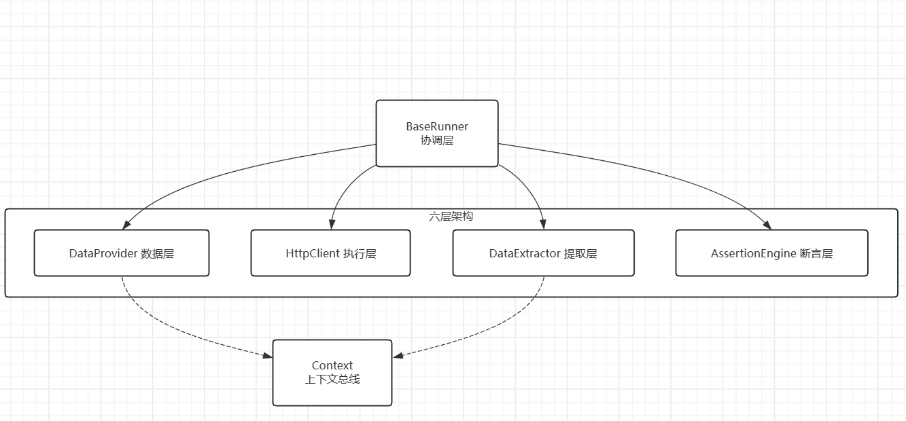
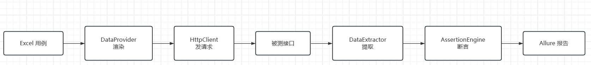

# 任务管理系统 · 接口自动化测试框架
基于 Python + Pytest 的接口自动化测试框架。被测对象为自建的 Flask 简易后端，用于可控构造测试场景；框架支持 Excel 数据驱动、HTTP + 数据库双重断言、串行与并行执行、Allure 可视化报告，并已部署至阿里云服务器，支持一键部署与测试
## 已适配后端

- **Flask 简易后端**：可控构造测试场景，验证框架基础能力；
- **JavaWeb 学生成绩管理系统**：适配真实业务场景，覆盖多角色状态流转、越权鉴权等安全测试。

> JavaWeb 后端的完整测试流程（抓包 → 接口分析 → 用例设计 → 框架适配 → 缺陷记录 → 回归用例）详见 [student-management-system](https://gitee.com/S1lenceYYY/student-management-system)。

两套后端复用同一套 Excel 数据驱动、断言逻辑和 Allure 报告能力。登录逻辑统一封装在 utils/auth_utils.py，串行与并行的差异仅通过 Fixture scope 控制。
## 技术栈
- **核心**：Python 3.11+ / Pytest / Requests
- **扩展**：pytest-xdist（并行）/ Allure-Pytest（报告）/ Jinja2（动态渲染）/ openpyxl（Excel 驱动）/ pymysql（数据库断言）
- **环境**：Linux / Shell / 阿里云 ECS

## 核心亮点
- **数据驱动**：用例写在 Excel 中，按场景分 Sheet 维护，新增/修改用例无需改代码。
- **双重断言**：接口返回和数据库落库结果都校验，避免“接口返回成功但数据没入库”的漏测。
- **并行执行**：基于 pytest-xdist 多进程并行，function 级后置清理，worker 间数据互不干扰。
- **动态渲染**：用例中的 `{{token}}`、`{{ID}}` 等占位符在执行时动态替换，解决接口间参数传递问题，让链路用例复用同一份 Excel。
- **场景分层**：串行链路、独立正向+反向、边界异常三类用例分开维护，串行用例保证依赖，并行用例提升速度，边界用例展示测试设计。
- **报告可视化**：接入 Allure，用例步骤、请求响应、SQL 断言详情都可在报告中追溯。
- **云端部署 + 一键脚本**：部署至阿里云 Ubuntu，编写 Shell 脚本实现部署、测试自动化

## 更多文档

- [框架设计与踩坑记录](docs/design.md)
- [JavaWeb 适配](docs/javaweb.md)
- [云端部署](docs/deploy.md)
- [JMeter 性能压测](jmeter/README.md)


## 架构设计图

 


## 框架流程图

 

## 项目结构

```text
jkzdh封装/                          # 源代码根目录 (F:\jkzdh封装)
├── backend/                        # 被测系统：Flask 后端
│   ├── settings.py                 # 后端配置（读 .env）
│   └── simulate_back.py            # Flask 服务入口
├── config/                         # 测试侧配置
│   └── config.py                   # 读 .env，暴露数据库/接口常量
├── data/                           # 测试数据
│   └── 用例.xlsx                   # 5 个 Sheet：串行/并行/边界/串行(java)/并行(java)
├── docs/                           # 项目文档
│   ├── architecture.png            # 六层架构图
│   ├── flow.png                    # 执行流程图
│   ├── allure_serial.png           # 串行报告截图
│   ├── allure_parallel.png         # 并行报告截图
│   ├── design.md                   # 框架设计与踩坑记录
│   ├── javaweb.md                  # JavaWeb 适配说明
│   └── deploy.md                   # 云端部署
├── log/                            # 运行日志目录 
│   └── ...                         # 存放执行过程中的日志文件
├── report/                         # 测试报告目录 
│   └── ...                         # 存放 Allure 生成的 HTML 报告
├── scripts/                        # 自动化脚本
│   ├── deploy.sh                   # 日常部署
│   ├── init.sh                     # 首次初始化 
│   └── run_test.sh                 # 测试 + 报告
├── testunion/                      # pytest 测试用例代码总目录 
│   ├── __init__.py                 # 标记为 Python 包
│   ├── flask/                      # Flask 项目测试
│   │   ├── __init__.py
│   │   ├── conftest.py             # Flask 专属 Fixture
│   │   ├── test_parallel.py        # 并行用例（无依赖，可 xdist 多进程）
│   │   └── test_runner.py          # 串行用例（有链路依赖，按顺序执行）
│   └── javaweb/                    # JavaWeb 项目测试 
│       ├── __init__.py
│       ├── conftest.py             # JavaWeb 专属 Fixture（多角色 Session、数据清理）
│       ├── test_java_parallel.py   # JavaWeb 并行用例 
│       └── test_javaweb.py         # JavaWeb 串行用例（登录、越权、双重断言）
├── utils/                          # 工具包
│   ├── __init__.py
│   ├── allure_utils.py             # Allure 报告步骤与附件封装
│   ├── analyse_case.py             # 解析用例，生成请求参数
│   ├── asserts.py                  # HTTP / 数据库断言
│   ├── auth_utils.py               # 鉴权工具模块(简化夹具)
│   ├── excel_utils.py              # Excel 读取
│   ├── extractor.py                # 响应提取：JSONPath / SQL / 参数
│   ├── render_obj.py               # Jinja2 模板渲染
│   └── send_request.py             # 发送 HTTP 请求
├── jmeter/                         # JMeter 性能压测（脚本 + HTML 报告）
├── conftest.py                     # 全局 Fixture
├── framework.py                    # 六层架构
├── .env                            # 实际环境变量文件 
├── .env.example                    # 环境变量模板
├── .gitignore                      # Git 忽略文件配置
├── init_db.py                      # 数据库初始化脚本
├── pytest.ini                      # pytest 全局配置
├── requirements.txt                # 依赖清单
├── run.py                          # 一键执行入口（默认串行 + Allure 报告）
└── README.md                       # 项目说明文档
```

## Excel 用例划分

`data/用例.xlsx` 分 5 个 Sheet：

| Sheet | 场景 | 执行方式 | 说明 |
|-------|------|---------|------|
| case1 | 串行链路 | 串行 | Flask后端：接口有前后依赖，上一步返回值传给下一步 |
| case2 | 独立用例 | 并行 | Flask后端：无依赖，可并行，覆盖正向和反向场景 |
| case3 | 边界异常 | 串行 | Flask后端：边界值、非法参数，后端不支持的标记不执行 |
| case4 | 多角色状态流转 | 串行 | JavaWeb后端：admin → teacher → student 跨角色链路，数据随角色流转，强依赖顺序 |
| case5 | 越权鉴权用例 | 并行 | JavaWeb后端：垂直越权、水平越权、鉴权校验等独立用例，无依赖多进程执行 |

case3 用于展示边界和异常场景的测试设计：
- 部分用例能跑通（如 size 超限、status 非法值）；
- 其余标记 `is_true=FALSE` 不执行，保留作为测试设计示例。

执行方式：修改 `test_runner.py` 中 `read_excel("case1")` 为 `read_excel("case3")`。

> case4 / case5 为适配 JavaWeb 后端新增：
> - **case4 多角色状态流转（串行）**：一条链路内依次使用 admin / teacher / student 会话，数据在角色间流转，强依赖执行顺序，必须按序执行；
> - **case5 越权鉴权用例（并行）**：单角色独立用例，相互无依赖，可通过 pytest-xdist 多进程并行提速。


## 环境要求

- Python 3.11+
- MySQL 8.0+
- Allure 命令行（生成 HTML 报告）

## 快速开始（本地部署）

### 1. 安装依赖

```bash
pip install -r requirements.txt
```

### 2. 配置环境变量

复制 `.env.example` 为 `.env`，填写数据库连接信息与密钥：

```bash
cp .env.example .env
```

`.env` 关键项说明：

| 变量 | 说明 |
|------|------|
| DB_HOST / DB_PORT / DB_USER / DB_PASSWORD / DB_NAME | MySQL 连接信息 |
| DB_CHARSET | 数据库字符集，默认 utf8mb4 |
| BASE_URL | 后端服务地址，默认 http://127.0.0.1:5000 |
| FLASK_HOST / FLASK_PORT | 后端服务监听地址和端口 |
| FLASK_DEBUG | 后端 debug 模式 |
| LOGIN_USER / LOGIN_PASSWORD | 自动化登录账号 |
| SECRET_KEY | JWT 密钥，需与后端一致 |
| JWT_EXPIRE | Token 过期时间（秒） |
| VAR_NAME | Excel 中 ID 提取字段的前缀 |
| EXCEL_FILE | Excel 用例文件路径 |

### 3. 初始化数据库

确保 MySQL 已启动，然后执行：

```bash
python init_db.py
```

脚本会自动完成：

- 创建数据库（默认 task_system）
- 创建 users、task 两张表
- 插入默认登录账号

### 4. 启动后端服务

```bash
python backend/simulate_back.py
```

启动成功后，访问 http://127.0.0.1:5000/health   返回 `{"status":"ok"}` 即正常。

### 5. 运行测试

另开一个终端，在项目根目录执行。

**方式一：pytest 命令（快速执行，看终端输出）**

```bash
# 串行链路（读 case1）
pytest -m "serial and flask"

# 并行正向（读 case2，4 个 worker）
pytest -n 4 -m "parallel and flask"
```

**方式二：run.py 一键执行（自动生成 Allure HTML 报告）**

```bash
# 默认执行串行链路用例（读 case1），并生成 Allure HTML 报告
python run.py
```

如需执行并行用例：

1. 注释掉 `run.py` 中串行部分
2. 取消 `run.py` 中并行部分的注释
3. 再次执行 `python run.py`

报告生成位置：

| 模式 | Allure 原始数据 | HTML 报告 |
|------|-----------------|-----------|
| 串行 | `/report/flask_serial/json` | `/report/flask_serial/html` |
| 并行 | `/report/flask_parallel/json` | `/report/flask_parallel/html` |

HTML 报告可直接用浏览器打开。如需临时启动服务查看：

```bash
# 串行
allure serve ./report/flask_serial/json

# 并行
allure serve ./report/flask_parallel/json
```
## 注意事项

- 后端启动和测试运行需要在两个不同的终端。
- 数据库表名默认为 `task` 和 `users`，当前在后端 SQL 和 Excel 用例中固定。如需修改，请同步修改Excel 用例中数据库断言里的表名。
- `.env` 含密码，不要提交到 Git，仓库中只保留 `.env.example`。
- 云端部署时，Shell 脚本换行符必须是 LF，否则报 `bad interpreter: /bin/bash^M`。

## Allure 报告示例

### 串行链路（14 条）


### 并行独立用例（22 条）


 ## 常见问题

| 问题 | 排查方向 |
|------|----------|
| 数据库连接失败 | 检查 `.env` 中账号密码、MySQL 是否启动、端口是否被占用 |
| 表不存在 | 是否执行过 `python init_db.py` |
| 登录失败 | `users` 表中是否有 `LOGIN_USER` 账号，`.env` 与后端 `SECRET_KEY` 是否一致 |
| 并行报错 | 是否已安装 pytest-xdist |
| 云端脚本找不到 venv | 确认 `cd "$(dirname "$0")/.."` 正确，或手动 `cd` 到项目根目录 |
| 云端 `git pull` 冲突 | 用 `git fetch --all && git reset --hard origin/main` 强制同步 |