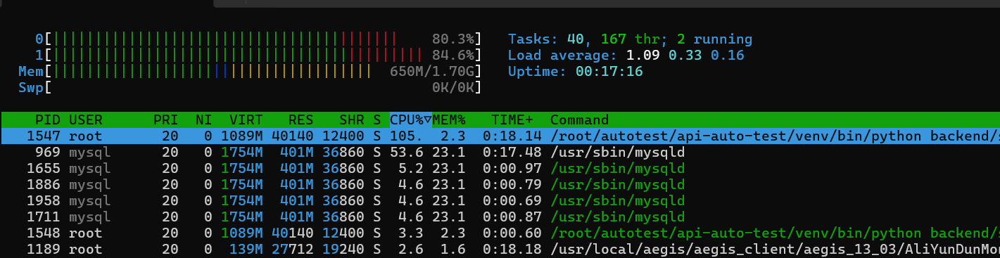

# JMeter 性能压测

对部署在阿里云 2G 服务器上的 Flask 任务管理服务进行阶梯压测，验证系统在并发压力下的性能表现。

## 被测系统

- **服务**：Flask + MySQL 任务管理服务
- **部署环境**：阿里云 Ubuntu 2 核 2G 内存服务器
- **接口链路**：登录 → 新增任务 → 查询任务 → 删除任务

## 测试工具

- JMeter 5.6.3：压测执行、并发模拟、报告生成
- htop：服务器资源监控

## 测试场景

每个线程依次执行完整链路：

1. `POST /login` — 登录，提取 token
2. `POST /task/add` — 新增任务，提取 task_id
3. `GET /task/get/${task_id}` — 查询任务
4. `DELETE /task/delete/${task_id}` — 删除任务

接口关联：

- 登录响应提取 `token`，用于后续请求的 `Authorization: Bearer ${token}`
- 新增任务响应提取 `task_id`，用于查询和删除

## 压测数据

| 并发数 | 平均响应 | 90%线 | 最大响应 | 错误率 | TPS |
|---|---|---|---|---|---|
| 10 | 107ms | 126ms | 156ms | 0% | 52.27 |
| 50 | 351ms | 457ms | 572ms | 0% | 113.95 |
| 100 | 770ms | 899ms | 1025ms | 0% | 116.16 |
| 150 | 1169ms | 1274ms | 4262ms | 0% | 117.48 |
| 200 | 1518ms | 2257ms | 21039ms | 0.13% | 114.49 |

## 测试结论

1. **性能拐点在 50 并发左右**
   - TPS 从 10 并发的 52.27 涨到 50 并发的 113.95，之后稳定在 114~117 区间，不再随并发增加而上升。
   - 从数据看，系统处理能力在 50 并发时已达到上限，50 并发后进入饱和状态。

2. **响应时间随并发持续上升**
   - 平均响应时间从 10 并发的 107ms 涨到 200 并发的 1518ms，涨幅约 14 倍。
   - 50 → 100 → 150 → 200 各档平均响应分别为 351ms、770ms、1169ms、1518ms，呈持续上升趋势。

3. **200 并发进入过载状态，出现长尾延迟**
   - 错误率从 0% 上升到 0.13%，出现 5 个失败请求。
   - 最大响应时间达到 21039ms（21 秒），远高于平均值的 1518ms。
   - 说明系统在过载状态下，有少量请求严重排队。

4. **瓶颈分析：应用层与数据库双重瓶颈**
   - 服务器为 2 核实例，单进程 Flask 受 Python GIL 限制，压测时 CPU 达到 105%，占满 1 个 CPU 核心；MySQL 占用 401M 内存、约 54% CPU，占用剩余算力。
   - 两个 CPU 核心分别达到 80.3% 和 84.6%，整机 CPU 接近饱和，请求出现操作系统调度排队。
   - 删除接口带来数据库写入开销，进一步放大长尾延迟。

## 资源监控

压测中（100~200 并发区间）观察到的典型资源占用：

- Flask 进程 CPU 105%，占满 1 个核
- MySQL 进程 CPU 54%，内存 401M
- 两个 CPU 核心分别 80.3% 和 84.6%



## 优化建议

1. 对数据库高频字段加索引，降低 SQL 执行开销。
2. 使用 gunicorn 多 worker 启动 Flask，突破单进程 GIL 限制，充分利用多核 CPU。
3. 合理调整 MySQL 的 `innodb_buffer_pool_size` 参数。
4. 压力持续上涨场景，可考虑升级服务器配置，或后续评估读写分离方案。

## 报告目录

- `report_10/` — 10 并发 HTML 报告
- `report_50/` — 50 并发 HTML 报告
- `report_100/` — 100 并发 HTML 报告
- `report_150/` — 150 并发 HTML 报告
- `report_200/` — 200 并发 HTML 报告

打开对应目录下的 `index.html` 可查看完整报告。


## 复现方式

> 注：`.jmx` 中 HTTP 请求默认值指向 `localhost:5000`，请先在本地启动 Flask 靶场。如需压测云端服务器，请将 Server Name 改为你的服务器地址。
>
> 线程数默认 100，可通过 `-Jthreads=N` 指定其他并发档位。

```bash

# 指定 10 并发 编辑-Jthreads
jmeter -n -t "HTTP请求.jmx" -l "result_10.jtl" -e -o "report_10" -Jthreads=10